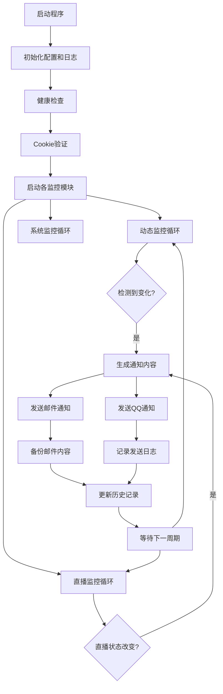

# B站动态监控系统 (BTCE) 项目概述

## 项目简介
BTCE 是一个基于 Python 的 Bilibili 动态和直播监控系统，能够自动监控指定 UP 主的动态更新、置顶评论变化和直播状态，并通过邮件和 QQ 消息进行实时通知。

## 项目结构

```

bili-dynamic-monitor/
├── main.py                    # 主程序入口
├── config.py                  # 主配置文件
├── config_email.py            # 邮箱配置
├── config_qq.py               # QQ配置
├── config_live.py             # 直播监控配置
├── dynamic.py                 # 监控动态列表
├── get_cookies.py             # 获取Cookie脚本
├── cookies.json               # 登录Cookie（自动生成）
├── requirements.txt           # 依赖包列表
├── README.md                  # 说明文档
├── live_monitor.py            # 直播监控逻辑
├── comment_renderer.py        # 评论渲染和检测
├── email_utils.py             # 邮件发送工具
├── qq_utils.py                # QQ消息发送工具
├── health_check.py            # 健康检查
├── logger_config.py           # 日志配置
├── performance_monitor.py     # 性能监控
├── status_monitor.py          # 状态监控
├── retry_decorator.py         # 重试装饰器
├── self_monitor.py            # 脚本自身状态监控
├── logs/                      # 日志目录（自动生成）
├── sent_emails/               # 邮件备份（自动生成）
└── bili_pinned_comment.json   # 历史记录（自动生成）

````

## 文件用途概述

### 核心配置文件
- **config.py**：主配置文件，包含基本运行参数和全局设置  
- **config_email.py**：邮件服务配置，设置 SMTP 服务器和发件人信息  
- **config_qq.py**：QQ 机器人配置，设置消息推送参数  
- **config_live.py**：直播监控配置，包括房间号、检查间隔、告警阈值等  
- **dynamic.py**：动态监控目标列表，定义需要监控的 UP 主信息  
- **cookies.json**：B站登录 Cookie 存储文件（自动生成）  
- **get_cookies.py**：Cookie 获取辅助脚本  

### 核心功能模块
- **main.py**：程序主入口，协调各模块运行  
- **comment_renderer.py**：处理评论 HTML 渲染、变化检测和消息内容生成  
- **email_utils.py**：邮件发送服务，负责构建和发送 HTML 格式邮件  
- **qq_utils.py**：QQ 消息发送，生成和推送纯文本格式消息  
- **live_monitor.py**：直播监控逻辑，检测 UP 主直播状态变化  

### 监控与维护模块
- **health_check.py**：系统健康检查，监控各组件运行状态  
- **performance_monitor.py**：性能监控，跟踪系统资源使用情况  
- **status_monitor.py**：状态监控，记录系统运行状态  
- **self_monitor.py**：脚本自身状态监控，确保监控脚本正常运行  
- **retry_decorator.py**：重试装饰器，为网络请求提供自动重试功能  

### 工具模块
- **logger_config.py**：日志系统配置，设置日志格式和输出位置  

### 自动生成文件
- **logs/**：日志文件存储目录  
- **sent_emails/**：已发送邮件备份目录  
- **bili_pinned_comment.json**：历史评论记录文件  

## 配置文件详细说明

### config.py - 主配置文件

```python
# 基本运行配置
UP_NAME = "目标UP主名称"           # 监控的UP主显示名称
CHECK_INTERVAL = 300             # 动态检查间隔（秒）
LIVE_CHECK_INTERVAL = 60         # 直播检查间隔（秒）
MAX_RETRY = 3                    # 网络请求最大重试次数
RETRY_DELAY = 5                  # 重试延迟（秒）

# 功能开关
ENABLE_DYNAMIC_MONITOR = True    # 启用动态监控
ENABLE_LIVE_MONITOR = True       # 启用直播监控
ENABLE_EMAIL_NOTIFY = True       # 启用邮件通知
ENABLE_QQ_NOTIFY = True          # 启用QQ通知

# 系统配置
LOG_LEVEL = "INFO"               # 日志级别：DEBUG/INFO/WARNING/ERROR
BACKUP_SENT_EMAILS = True        # 是否备份已发送邮件
MAX_LOG_DAYS = 30                # 日志保留天数
````

### config_email.py - 邮箱配置

```python
# SMTP服务器配置
SMTP_SERVER = "smtp.qq.com"      # SMTP服务器地址
SMTP_PORT = 587                  # SMTP端口（TLS）
EMAIL_SENDER = "sender@qq.com"   # 发件邮箱地址
EMAIL_PASSWORD = "授权码"        # 邮箱授权码（非登录密码）
EMAIL_RECEIVERS = [              # 收件人列表
    "receiver1@example.com",
    "receiver2@example.com"
]

# 邮件内容配置
EMAIL_SUBJECT_PREFIX = "[B站监控]"  # 邮件主题前缀
EMAIL_TEMPLATE = "default"          # 邮件模板类型
```

### config_qq.py - QQ配置

```python
# QQ机器人配置（基于Go-CQHTTP）
QQ_BOT_URL = "http://127.0.0.1:5700"  # Go-CQHTTP服务地址
QQ_GROUP_ID = 123456789                # 目标QQ群号
MAX_MESSAGE_LENGTH = 1000              # 单条消息最大长度
ENABLE_IMAGE = True                     # 是否发送图片

# 消息格式配置
QQ_MESSAGE_TEMPLATE = "default"  # QQ消息模板
NOTIFY_ON_STARTUP = True         # 启动时发送通知
```

### dynamic.py - 监控动态列表

```python
# 监控目标配置格式
MONITOR_LIST = [
    {
        "uid": "123456789",           # UP主UID（必填）
        "name": "目标UP主名称",        # 显示名称
        "dynamic_check": True,        # 监控动态更新
        "comment_check": True,        # 监控置顶评论
        "live_check": True,           # 监控直播状态
        "priority": 1                 # 监控优先级（1-10）
    }
]
```

#### 添加新监控目标方法

1. 在 `MONITOR_LIST` 列表中添加新的字典项
2. 填写正确的 UID 和名称
3. 设置相应的监控开关
4. 设置优先级（数字越小优先级越高）

## 功能概览

### 核心功能

1. **动态监控**：实时监控 UP 主新动态发布，检测置顶评论内容和图片变化，支持多 UP 主同时监控
2. **直播监控**：检测 UP 主直播状态变化，开播/下播实时通知
3. **多平台通知**：邮件通知（HTML格式，支持图片和样式）、QQ群通知（纯文本，支持CQ码图片）
4. **系统监控**：健康状态检查、性能监控和资源使用跟踪、脚本自身状态监控

### 运行流程



## 使用方法

### 1. 环境准备

```bash
pip install -r requirements.txt
```

主要依赖包：

* beautifulsoup4>=4.9.0
* requests>=2.25.0
* aiohttp>=3.8.0
* playwright>=1.40.0

### 2. 获取 B站 Cookie

```bash
python get_cookies.py
```

或手动配置：

1. 登录 B站网页版
2. 打开开发者工具 → Network 标签页
3. 刷新页面，复制 Cookie 值
4. 保存到 `cookies.json` 文件

### 3. 配置监控目标

编辑 `dynamic.py` 的 `MONITOR_LIST` 添加 UP 主信息

### 4. 配置通知方式

* 编辑 `config_email.py` 设置邮件
* 编辑 `config_qq.py` 设置 QQ 机器人

### 5. 运行程序

```bash
python main.py
```

后台运行：

```bash
nohup python main.py > logs/monitor.log 2>&1 &
```

使用系统服务：

```bash
sudo systemctl enable bili-monitor
sudo systemctl start bili-monitor
```

### 6. 查看日志和状态

```bash
tail -f logs/monitor.log
grep "ERROR" logs/monitor.log
python health_check.py
```

## 注意事项 & 提醒

### 🔐 隐私安全

* Cookie 保护：B站 Cookie 包含登录凭证，务必妥善保管
* 授权码管理：邮箱授权码应使用应用专用密码
* 配置文件隔离：建议将配置文件放在安全目录

### ⚠️ 频率限制

* 遵守 B站 API 请求间隔
* 监控过多 UP 主可能触发限制
* 程序包含自动重试机制

### 🔧 运行维护

* 定期检查日志
* 定期更新 Cookie
* 定期更新 Python 包

### 📊 性能优化

* 注意内存管理，定期重启
* 网络保持稳定
* 定期清理日志和备份

## 故障排除

1. **Cookie失效**：运行 `python get_cookies.py`
2. **网络连接失败**：检查网络，调整重试参数
3. **邮件发送失败**：检查授权码和 SMTP 设置
4. **QQ 消息未发送**：检查 QQ 机器人服务状态

### 调试模式

```python
LOG_LEVEL = "DEBUG"
DEBUG_MODE = True
```

### 健康检查

```bash
python health_check.py --detailed
```

## 版本信息

* **项目名称**：B站动态监控系统 (BTCE)
* **当前版本**：v1.0.0
* **Python要求**：3.8+
* **最后更新**：2026年1月12日

---

*本文档随项目更新而维护，请定期查看最新版本。如有问题，请查看日志文件或联系维护人员。*


